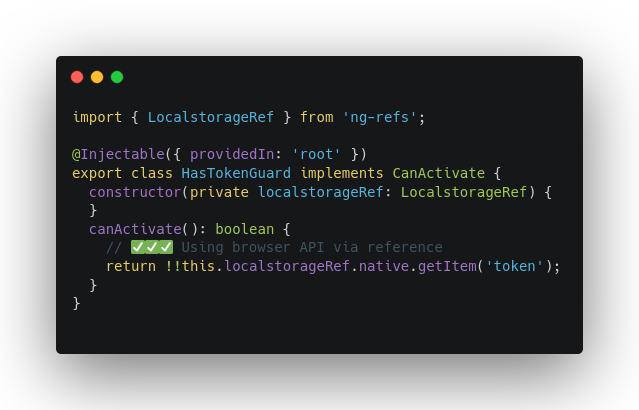

# ng-refs


Practice better dependency injection of browser APIs within your Angular codebase!

Are we missing a browser API that your project uses?.. [suggestions and contributions](https://github.com/METACEO/ng-refs/issues) are welcomed!

| Type of use     | Code Example                   |
| --------------- | ------------------------------ |
| ❌ Direct-use    |  |
| ✅ Via reference |    |

Similar to Angular's [own `DOCUMENT` token](https://angular.io/api/common/DOCUMENT), the `ng-refs` package includes some other commonly used browser APIs wrapped up as Angular providers:

- `AnimationFrameRef`
- `ConsoleRef`
- `GetComputedStyleRef`
- `IntervalRef`
- `LocalStorageRef`
- `LocationRef`
- `SessionStorageRef`
- `TimeoutRef`
- `WindowRef`

In this [Nx](https://nx.dev) monorepo, you can find the following:

- The library source code [[libs](./libs/ng-refs)]
- An example consuming Angular application and unit tests [[apps](./apps/ng-refs-demo)]
- An e2e test suite [[apps](./apps/ng-refs-demo-e2e)]

## Install ng-refs for Angular references

Install these references via [NPM](https://www.npmjs.com/package/ng-refs) or [Yarn](https://yarnpkg.com/package/ng-refs) into your Angular project.

```
npm install ng-refs
```
```
yarn add ng-refs
```

You can then import `NgRefsModule` into your Angular application. You can find an example [here in this repository](./apps/ng-refs-demo/src/app/app.module.ts). You can also import and provide the references directly in your own Angular modules.

## Serve the demo for development

Run `start` for a dev server. Navigate to http://localhost:4200/.

## Build the library for production

Run `ng build ng-refs --prod` to build the library for publishing. The build artifacts will be stored in the `dist/libs/ng-refs` directory.

## Run all required unit tests

Run `affected:test` to execute the unit tests affected by a change.

## Run all required end-to-end tests

Run `affected:e2e` to execute the end-to-end tests affected by a change.
